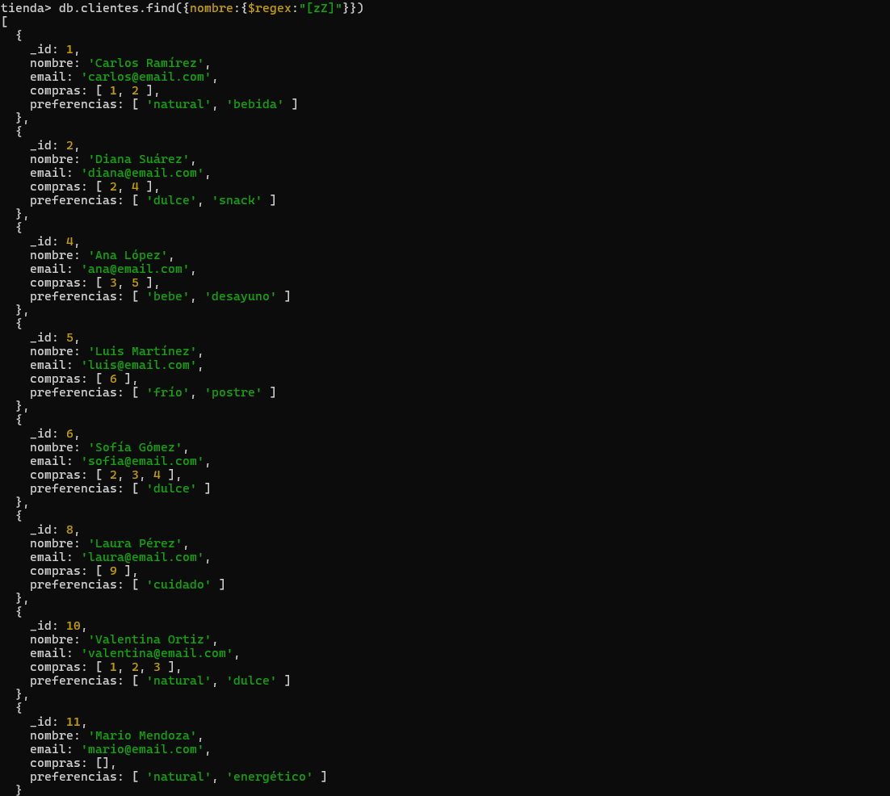

# Tienda de borojo 

## Inserción 

- Insertar un nuevo producto llamado "Chocolatina de borojó", categoría "Snack", con precio 4000, stock 35, y tags ["dulce", "energía"].


```javascript
db.productos.insertOne({ "_id": 11, "nombre": "Chocolatina de borojó", "categoria": "Snack", "precio": 4000, "stock": 35, "tags": ["dulce", "energía"] })
```


- Insertar un nuevo cliente que se llama "Mario Mendoza", con correo "mario@email.com", sin compras, y preferencias "energético" y "natural".

```javascript
db.clientes.insertOne({ "_id": 11, "nombre": "Mario Mendoza", "email": "mario@email.com", "compras": [], "preferencias": ["natural", "energético"] })
```


## Lectura

- Consultar todos los productos que tengan stock mayor a 20 unidades.

```javascript
db.productos.find({stock:{$gt:20}})
```


- Encontrar los clientes que no han comprado aún ningún producto.

```javascript
db.clientes.find({compras:{$not:{$gt:0}}})
```


## Actualización
- Aumentar en 10 unidades el stock del producto "Borojó deshidratado".

```javascript
db.productos.updateOne({nombre:"Borojó deshidratado"},{$inc:{stock:10}})
```


- Añadir el tag "bajo azúcar" a todos los productos de la categoría "Bebida".

```javascript
db.productos.updateMany({categoria:"Bebida" },{$push:{ tags:"bajo azúcar"} })
```


## Eliminación

- Eliminar el cliente que tenga el correo "juan@email.com".
```javascript
db.clientes.findOne({email:"juan@email.com"})
```


- Eliminar todos los productos con stock menor a 5 (considera esto como un proceso de limpieza de inventario).

```javascript
db.productos.deleteMany({stock:{$lt:5} })
```


## Consultas con Expresiones Regulares

- Buscar productos cuyo nombre empiece por "Boro".

```javascript
db.productos.find({nombre:{$regex:"^Boro"}})
```


- Encontrar productos cuyo nombre contenga la palabra "con" (como en “Concentrado de borojó”).


```javascript
db.productos.find({nombre:{$regex:"[cC]on"}})
```


- Encontrar clientes cuyo nombre tenga la letra "z" (insensible a mayúsculas/minúsculas).

```javascript
db.clientes.find({nombre:{$regex:"[zZ]"}})
```


## Operadores en consultas sobre arrays

Buscar clientes que tengan "natural" en sus preferencias.

```javascript
db.clientes.find({preferencias:{$in:["natural"] }})
```


- Encontrar productos que tengan al menos los tags "natural" y "orgánico" (usa $all).

```javascript
db.productos.find({tags:{$all:["natural","orgánico"]}})
```


- Listar productos que tienen más de un tag ($size).
```javascript
db.productos.find({  $and: [    { tags: { $not: { $size: 0 } } },    { tags: { $not: { $size: 1 } } }  ]})
```


## Aggregation Framework con Pipelines

- Mostrar un listado de los productos más vendidos (suma total de unidades vendidas por producto).

```javascript
db.ventas.aggregate([{ $unwind: "$productos" }, {$group: {_id: "$productos.productoId",totalUnidadesVendidas: { $sum: "$productos.cantidad" }}},{ $sort: { totalUnidadesVendidas: -1 } }])
```


- Agrupar clientes por cantidad de compras realizadas.

```javascript
db.clientes.aggregate([{$project:{nombre:1,compras:{$size:"$compras"} } }])
```


- Mostrar el total de ventas por mes (usa $group y $month).

```javascript
db.ventas.aggregate([{$project:{pormes:{$month:"$fecha"},total:1 }  },{$group:{_id:"$pormes",total:{$sum:"$total"} } } ])
```


```javascript
- Calcular el promedio de precios por categoría de producto.
```
db.productos.aggregate([{$group:{_id:"$categoria",promedio:{$avg:"$precio"} } }])


- Mostrar los 3 productos con mayor stock (orden descendente con $sort y $limit).   

```javascript
db.productos.aggregate([{$group:{_id:"$nombre",stock:{$max:"$stock"} }},{$sort:{stock:-1}},{$limit:3} ])
```

 

## Funciones definidas en system.js
Definir una función calcularDescuento(precio, porcentaje) que devuelva el precio con descuento aplicado.

```javascript
function calcularDescuento(precio, porcentaje){  let total = precio - (precio * porcentaje )/100; return total};
```


- Definir una función clienteActivo(idCliente) que devuelva true si el cliente tiene más de 3 compras registradas.

```javascript
function clienteActivo(idCliente){    let cliente = db.clientes.findOne({_id:idCliente});print(cliente.compras.length);if (cliente.compras.length >3) {return print(true)} else {return print(false)};};
```


- Definir una función verificarStock(productoId, cantidadDeseada) que retorne si hay suficiente stock.

```javascript
function verificarStock(productoId, cantidadDeseada){let producto  = db.productos.findOne({_id:productoId}); if (producto.stock > cantidadDeseada) { return print("si hay suficiente stock")  } else { return print("no hay suficiente stock") };};
```

